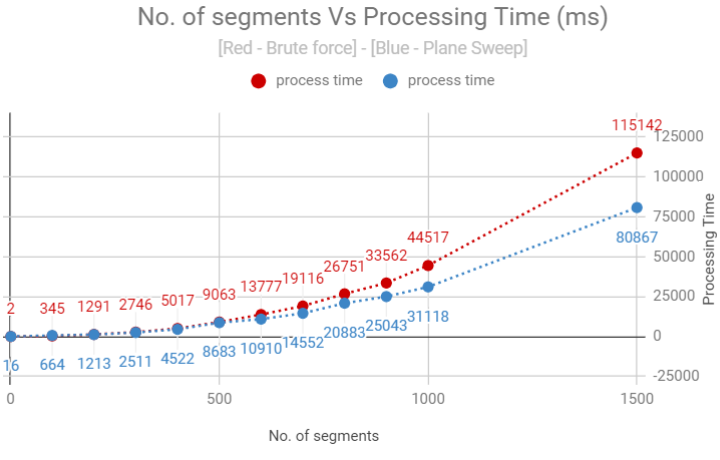

# Geometric Algorithms
Geometric Algorithms implemented in Java and Processing v3. Algorithms details can be found at: [Computational Geometry - Algorithms and Applications, 3rd Ed](https://people.inf.elte.hu/fekete/algoritmusok_msc/terinfo_geom/konyvek/Computational%20Geometry%20-%20Algorithms%20and%20Applications,%203rd%20Ed.pdf).

#### Brute Force Plane sweep
Initial implementation of an efficient Plane sweep Line Segment Intersection. This visualization program shows how the brute force works its way in a 2D loop to find all the intersections from some given points that form lines. Basically, every line checks against the others for some point intersection. The text file on the data directory contains the points that form lines following this format separated only by space. Example:

| *x0*  |  *y0* |  *x1* |  *y1* |
| ------|------ | ------|------ |
|  91   |  179  |  760  |  353  |
|  874  |  890  |  648  |  114  |
|  687  |  715  |  939  |  747  |

(The x0, y0, x1, y1 line doesn't exist in the file, just the numbers). 

If you run the program the user can either choose the txt file contenting the points or just cancel the file choosing to automatically generate a random number of points (from 2~100). By running the visualization it will produce a file "output.txt" with the number of points, intersections, processing time and other relevant data. The algorithm itself is found on processing setup() function and it is general enough to be use in any Java aplication. The visualization just shows how the algorithm works in a slow, comprehensible manner. See below the visualization:

Visualization of Line Intersections brute force search algorithm

(25 lines, 60 intersections found, 300 checks)

Although it looks very inefficient, the number of checks in the brute force increases as O(n²) number of segments, to be exact: n(n-1) as it searches 1 line against the other, it is surprisinly efficient for a small quantity of segments compared with my implematation of Bentley-Ottmann algorithm.

#### Plane sweep by Bentley-Ottmann algorithm
This implementation is heavily based on [valenpe7's bentley-ottmann](https://github.com/valenpe7/bentley-ottmann). Yeah, after the first two weeks I gave up trying to do this by myself (I see I was doing the compareTo() on segment class very naive so statusT was doing bananas), so kudos to user valenpe7. I remember being the guy that lent homework to others. Now I lurk GitHub for people that are better than me when I fail.

 * pseudo code: http://geomalgorithms.com/a09-_intersect-3.html
 * pseudo code: https://en.wikipedia.org/wiki/Bentley%E2%80%93Ottmann_algorithm#Detailed_algorithm
 
Three weeks trying to do this to discover that it is only more efficient than the bruteforce method after 200 random generated segment lines are used. And by doing efficiency measurement tests I discovered that my implementation of Bentley-Ottmann does not work properlly if there are too much dense segments it starts to miss intersections. Really a fuck, but I am tired of fixing this shit for a 4th week. It is probably how the sort of segments lines, on 'value' field is done, but I don't know a way to fix. It still works for not so dense lines, like less than 100 random lenght lines in a canvas of 700x700, but I would not trust this implemetation. I passed the [Coursera geometric-algorithms course](https://www.coursera.org/learn/geometric-algorithms) (max case was 25 segment lines) using it, but don't use without knowing where it's the problem and how to fix. This will probably rot on this repository.

All the time measurements are the running the program x 1000 in a loop, to accommodate any error. Time is in milliseconds. So when this Bentley-Ottmann algorithm is supposed to get better and less demanding than bruteforce it also when it starts stoping working well. What a crap. But I guess these findings I'm typing bellow are still valid points (maybe).

|*1. [No. of segment lines vs processing time for a random length generated segment](https://docs.google.com/spreadsheets/d/e/2PACX-1vQ4nOoyaxvTKE0HhDcychAWUPYK3t8FUJRSk0x6pymUnr3LD164CGzDxcxWQlfR1yznifTxzVgPLx0v/pubhtml) (2 points generated randomly in the canvas space)*|
|     :---:      |

In the graph, we see the Bentley-Ottmann algorithm is less efficient than the bruteforce search until around 200 segment lines (each measure is spaced by 100). The number of checks in the brute force increases as expected O(n²) (see 1st graph above), on the other hand, the Bentley-Ottmann algorithm the number of events grows somewhat linearly for this case. But since for each event there are a lot happening: writing/deleting/get operations in the eventQ and statusT, it is much more demanding than a simple intersection check from the bruteforce operation.

|*2. [No. of segment lines vs processing time for a random segments (x,y)->([x−r,x+r],[y−r,y+r]), r = random(0,1*canvas length)](https://docs.google.com/spreadsheets/d/e/2PACX-1vTxIMpXKEufHXEGtm6qS2636O-yh7hjZEfwZZtR-XvSsf0iT9uCbrmDGCw778L3sz6Pz4vYrYGR6uG0/pubhtml)*|
|     :---:      |

The Bentley-Ottmann algorithm only became faster than the bruteforce somewhere after 1000 segments and below 1500 segments. Its efficiency grow is really not consistent as we can see in the graph.

![Plane Sweep Intersections- Number of segments Vs Processing Time for a random segments (x,y)->([x−r,x+r]×[y−r,y+r]), r ~ 1](imgs/PlaneSweepIntersections_Number_of_segments_Vs_Time_R_one.png)

|*3. [No. of segment lines vs processing time for a random segments (x,y)->([x−r,x+r],[y−r,y+r]), r = random(0,canvas length*n^(−1/4))](https://docs.google.com/spreadsheets/d/e/2PACX-1vRE2U37OiXiYQjQPAUFpoW1uM97GNsVcMV1_7i2AI2zob1qp0YmnD7r9PBbKb79g-rf9JbjfcQEg3nH/pubhtml) (n = number of segment lines)*|
|     :---:      |

The Bentley-Ottmann algorithm became faster than the bruteforce somewhere after 300 segments. The segments are less dense, so fewer intersections and fewer event points.

![Plane Sweep Intersections- Number of segments Vs Processing Time for a random segments (x,y)->([x−r,x+r]×[y−r,y+r]), r ~ n^(−1/4)](imgs/PlaneSweepIntersections_Number_of_segments_Vs_Time_R_n^(-0.25).png)

|4. [No. of segment lines vs processing time for a random segments (x,y)->([x−r,x+r],[y−r,y+r]), r = random(0,canvas length*n^(−1/2))](https://docs.google.com/spreadsheets/d/e/2PACX-1vQY35_mZ76fuArPIIvWugJj2CGvOofrZRpMIdOPA6Ukqbrhjxii6EOzb_uOrSOz8DwIYw6fahwpSsQY/pubhtml) (n = number of segment lines)*|
|     :---:      |

The algorithm became faster than the bruteforce somewhere after 200 segments. The segments are even less dense, so even fewer intersections and fewer event points.

![Plane Sweep Intersections- Number of segments Vs Processing Time for a random segments (x,y)->([x−r,x+r]×[y−r,y+r]), r ~ n^(-0.5))](imgs/PlaneSweepIntersections_Number_of_segments_Vs_Time_R_n^(-0.5).png)

|5. [No. of segment lines vs processing time for a random segments (x,y)->([x−r,x+r],[y−r,y+r]), r = random(0,canvas length*n^(−1))](https://docs.google.com/spreadsheets/d/e/2PACX-1vTisWdMc-XgSp343aRCjHcnr3xnpctN9-IXy4t4UdHkyjgjLtkbX6LHNG-W2TYKdCJIGzOlUh9oakhp/pubhtml) (n = number of segment lines)*|
|     :---:      |

With this r, the length of the segment lines are so small (near zero), they are basically dots scattered in the canvas and there are never any intersection. So, of course, the Bentley-Ottmann algorithm will perform better. The only events that occur are the start and end events.

![Plane Sweep Intersections- Number of segments Vs Processing Time for a random segments (x,y)->([x−r,x+r]×[y−r,y+r]), r ~ n^(−1)](imgs/PlaneSweepIntersections_Number_of_segments_Vs_Time_R_n^(-1).png)

\- \- \-

\[ all code available under MIT License - feel free to use. \]
